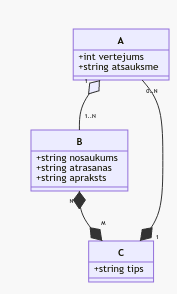

# Generate code from a mermaid markdown file

## Example

From a [mermaid](https://mermaid-js.github.io/mermaid/) code like this:

```text

    A "1" o-- "1..N" B
    B "N" *--* "M" C
    A "0..N" --* "1" C

    class A {
        +int vertejums
        +string atsauksme
    }
    class B {
        +string nosaukums
        +string atrasanas vieta
        +string apraksts
    }
    class C {
        +string tips
    }
```

which, with the help of Mermaid JS generates a diagram like this



and with the help of this utility code generates this:

```Python
from django.db import models

class C(models.Model):
    tips = models.CharField(max_length=100)

class A(models.Model):
    C_fk = models.ForeignKey('C')
    vertejums = models.IntegerField()
    atsauksme = models.CharField(max_length=100)

class B(models.Model):
    A_fk = models.ForeignKey('A')
    C_fk = models.ManyToManyField('C')
    nosaukums = models.CharField(max_length=100)
    atrasanas = models.CharField(max_length=100)
    apraksts = models.CharField(max_length=100)

```

## Usage

Follow the pattern of `[executable] [input file] [backend] [output file]`

Example:
```sh
./target/release/mermaid-parser sample/classes.md django output/models.py
```

## Compilation

```sh
cargo build --release
```

## Backends

Currently supported backends:

- Django
