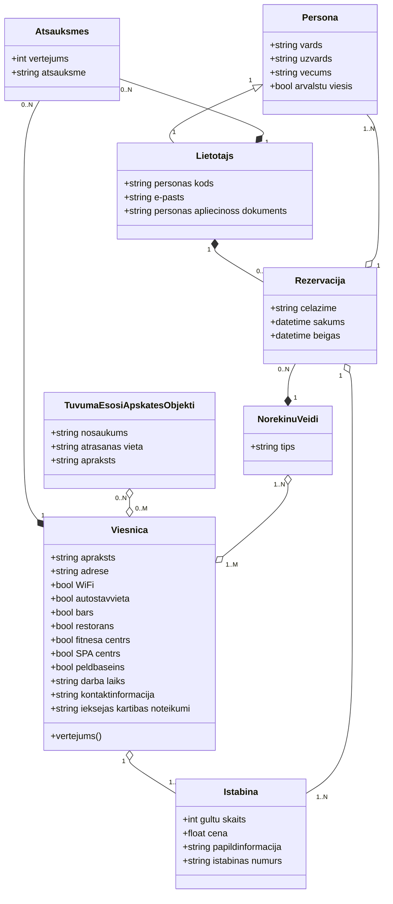

```mermaid
 classDiagram

    Persona "1" <|-- "1" Lietotajs
    Viesnica "1" o-- "1..N" Istabina
    Atsauksmes "0..N" --* "1" Viesnica
    TuvumaEsosiApskatesObjekti "0..N" o--o "0..M" Viesnica
    NorekinuVeidi "1..N" o--o "1..M" Viesnica
    Rezervacija "1" o-- "1..N" Istabina
    Lietotajs "1" *-- "0..N" Rezervacija
    Rezervacija "1" o-- "1..N" Persona
    Rezervacija "0..N" --* "1" NorekinuVeidi
    Atsauksmes "0..N" --* "1" Lietotajs

    class Viesnica{
        +string apraksts
        +string adrese
        +bool WiFi
        +bool autostavvieta
        +bool bars
        +bool restorans
        +bool fitnesa centrs
        +bool SPA centrs
        +bool peldbaseins
        +string darba laiks
        +string kontaktinformacija
        +string ieksejas kartibas noteikumi
        +vertejums()
    }
    class Atsauksmes {
        +int vertejums
        +string atsauksme
    }
    class TuvumaEsosiApskatesObjekti {
        +string nosaukums
        +string atrasanas vieta
        +string apraksts
    }
    class NorekinuVeidi {
        +string tips
    }
    class Istabina {
        +int gultu skaits
        +float cena
        +string papildinformacija
        +string istabinas numurs
    }
    class Persona {
        +string vards
        +string uzvards
        +string vecums
        +bool arvalstu viesis

    }
    class Lietotajs {
        +string personas kods
        +string e-pasts
        +string personas apliecinoss dokuments
    }
    class Rezervacija {
        +string celazime
        +datetime sakums
        +datetime beigas
    }
```
