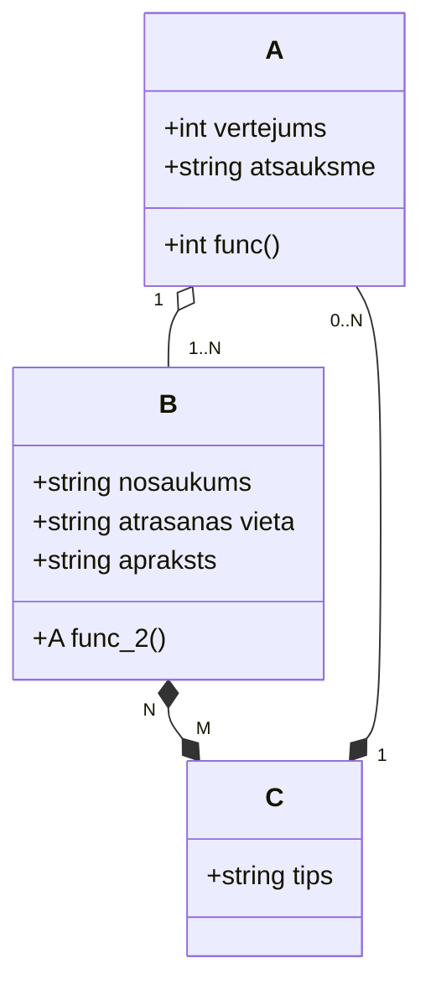

```mermaid
 classDiagram

    A "1" o-- "1..N" B
    B "N" *--* "M" C
    A "0..N" --* "1" C

    class A {
        +int vertejums
        +string atsauksme
        +int func()
    }
    class B {
        +string nosaukums
        +string atrasanas vieta
        +string apraksts
        +A func_2()
    }
    class C {
        +string tips
    }
```
